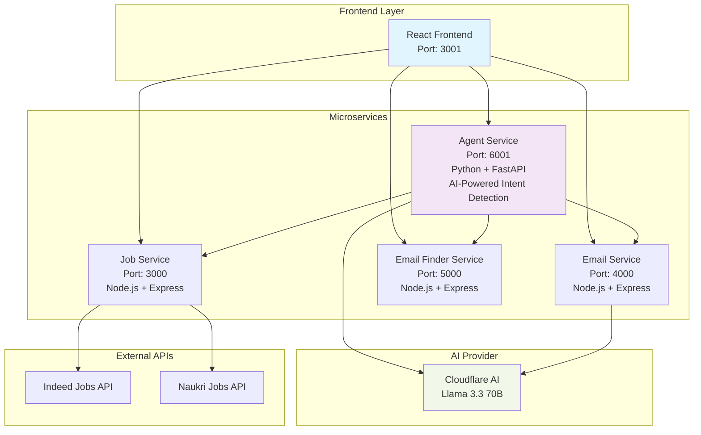

# Agentic Job Search Assistant

An intelligent job search platform powered by multi-provider AI agents that can search for jobs, find recruiter emails, and draft professional application emails through natural language conversations.

#### Members
- Sanika Ardekar (sanikaardekar@gmail.com)
- Prachet Shah (prachetshah25@gmail.com)

#### [Video Demo](https://youtu.be/f8rd3Q4T1AA)


## Problem Statement & Agentic AI Connection

### What Problem Does It Solve?

Job searching is a complex, multi-step process that typically requires:
- **Manual Platform Navigation**: Switching between multiple job sites (Indeed, Naukri, LinkedIn)
- **Recruiter Contact Discovery**: Spending hours finding the right hiring contacts
- **Personalized Email Crafting**: Writing tailored application emails for each position
- **Context Switching**: Managing information across different tools and platforms

This creates friction, inefficiency, and missed opportunities for job seekers.

This is where Agentic AI comes in, enabling autonomous agents that understand user intent, orchestrate multi-step workflows, and adapt dynamically. Instead of juggling multiple platforms, the system uses natural language to search jobs, find recruiter emails, and draft personalized applications, while preserving context and ensuring seamless execution.

A single conversational interface that replaces hours of manual work with intelligent, autonomous task execution.

## Architecture Overview



## Features

### AI-Powered Agent Service
**Uses Cloudflare AI (Llama 3.3 70B) for intelligent intent detection and parameter extraction from natural language queries.**

### Service Functions 
- **Agent Service**: Uses AI to understand user intent and route to appropriate microservices
- **Job Service**: Aggregates job listings from Indeed, Naukri, and other platforms
- **Email Finder**: Discovers recruiter contacts (currently generates realistic dummy data)
- **Email Service**: Generates personalized application emails using Cloudflare AI

### Note on Email Finder
The email finder service currently generates realistic dummy email addresses based on company names. To enable real email discovery:
1. Add `HUNTER_API_KEY` to your `.env` file
2. Add `SERPAPI_KEY` for Google search integration
3. Uncomment the real API calls in `email-finder-service/src/services/emailFinder.ts`

## Technology Stack

| Component | Technology | Purpose |
|-----------|------------|---------|
| **Frontend** | React + TypeScript | User interface and interaction |
| **Agent Service** | Python + FastAPI | AI-powered intent detection and orchestration |
| **Job Service** | Node.js + Express | Job search and aggregation |
| **Email Service** | Node.js + Express | Email drafting using Cloudflare AI |
| **Email Finder** | Node.js + Express | Recruiter email discovery |
| **AI Provider** | Cloudflare AI (Llama 3.3 70B) | Intent detection and email generation |
| **Containerization** | Docker + Docker Compose | Deployment and orchestration |

### Test Commands
Try these in the AI chat at http://localhost:3001:
- "Find React jobs in Mumbai"
- "Get recruiter emails for Google"
- "Draft email for software engineer position"

## Quick Start

### 1. Clone Repository
```bash
git clone <repository-url>
cd kong-agentic-ai
```

### 2. Configure Environment
```bash
# Backend environment
cp .env.example .env

# Frontend environment
cd frontend
cp .env.example .env
cd ..
```

Required backend environment variables:
```env
# Cloudflare AI (Required - used for intent detection and email generation)
CLOUDFLARE_ACCOUNT_ID=your_account_id
CLOUDFLARE_API_TOKEN=your_api_token

# Optional: For real email finding (currently uses dummy data)
SERPAPI_KEY=your_serpapi_key
HUNTER_API_KEY=your_hunter_api_key
CLEARBIT_API_KEY=your_clearbit_api_key
```

Frontend environment variables:
```env
# API Base URL - change for deployment
REACT_APP_API_BASE_URL=http://localhost

# For production deployment:
# REACT_APP_API_BASE_URL=https://your-domain.com
# or
# REACT_APP_API_BASE_URL=http://your-server-ip
```

### 3. Start Services
```bash
# Start all backend services
docker-compose up -d

# Start frontend (in separate terminal)
cd frontend
npm install
npm start
```

### 4. Access Application
- **Frontend**: http://localhost:3001
- **Agent Service**: http://localhost:6001
- **Job Service**: http://localhost:3000
- **Email Service**: http://localhost:4000
- **Email Finder**: http://localhost:5000

## Quick Commands

### Start Everything
```bash
# Start all backend services
docker-compose up -d

# Wait for services to start (15 seconds)
# Then test if services are running
node test-services.js

# Start frontend (new terminal)
cd frontend
npm start
```

### Windows Quick Start
```bash
# Run the startup script
start.bat
```

### Troubleshooting

If frontend can't connect to services:

1. **Check if services are running:**
```bash
docker-compose ps
```

2. **Test service health:**
```bash
node test-services.js
```

3. **Check service logs:**
```bash
docker-compose logs agent-service
```

4. **Restart services:**
```bash
docker-compose down
docker-compose up -d
```

5. **Verify frontend .env file exists:**
```bash
cd frontend
cat .env
# Should show: REACT_APP_API_BASE_URL=http://localhost
```

## Deployment

### For Production Deployment:

1. **Update Frontend API URL**:
```bash
cd frontend
echo "REACT_APP_API_BASE_URL=https://your-domain.com" > .env
# or for IP-based deployment:
echo "REACT_APP_API_BASE_URL=http://your-server-ip" > .env
```

2. **Build Frontend**:
```bash
npm run build
```

3. **Deploy Services**:
```bash
# Deploy backend services
docker-compose up -d

# Serve frontend build folder with nginx/apache
# or deploy to Vercel/Netlify/AWS S3
```

### Service Ports (configure firewall accordingly):
- Frontend: 3001
- Job Service: 3000
- Email Service: 4000
- Email Finder: 5000
- Agent Service: 6001

## Usage Examples along with Demo Screenshots (Video in end)

### Homepage


### Job Search with AI-Powered Intent Detection
```
User: "Find React developer jobs in Mumbai"
Agent: [AI] Detecting intent using Cloudflare AI...
       [INTENT] Detected: job_search
       [PARAMS] jobRole: react, location: mumbai
       Searching for React jobs in Mumbai...
       Found 15 jobs! Here are the matches:
       
       1. React Developer at TechCorp
          Location: Mumbai, Maharashtra
          [Apply Here]
       
       2. Frontend Engineer at StartupXYZ
          Location: Mumbai, Maharashtra  
          [Apply Here]
```


### Email Discovery (Either via found jobs, or directly via Agent)
```
User: "Get recruiter emails for Google"
Agent: [INTENT] Detected: EMAIL_FINDER
       Searching emails for Google...
       Found 5 recruiter emails:
       
       - recruiter@google.com (high confidence)
       - talent@google.com (medium confidence)
       - hiring@google.com (high confidence)
```
#### Emails via Found Jobs (Clicking on get Recruiter Emails)


#### Emails via Agent(using prompt)


### Email Drafting with Cloudflare AI
```
User: "Draft email for Netflix software engineer position"
Agent: [AI] Detecting intent using Cloudflare AI...
       [INTENT] Detected: email_draft
       [PARAMS] jobTitle: software engineer, company: netflix
       Drafting professional email with Cloudflare AI...
       Email drafted successfully!
       
       Subject: Application for Software Engineer Position
       
       Dear Hiring Manager,
       
       I hope this email finds you well. I came across the Software Engineer 
       position at Netflix and I am very excited about the opportunity...
```


## Monitoring & Logs


## Manual Search Functionality without Prompting


