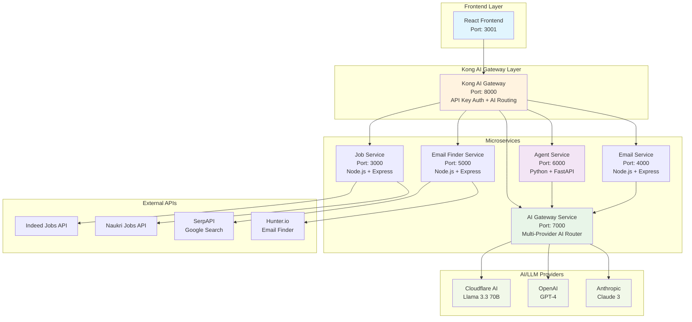
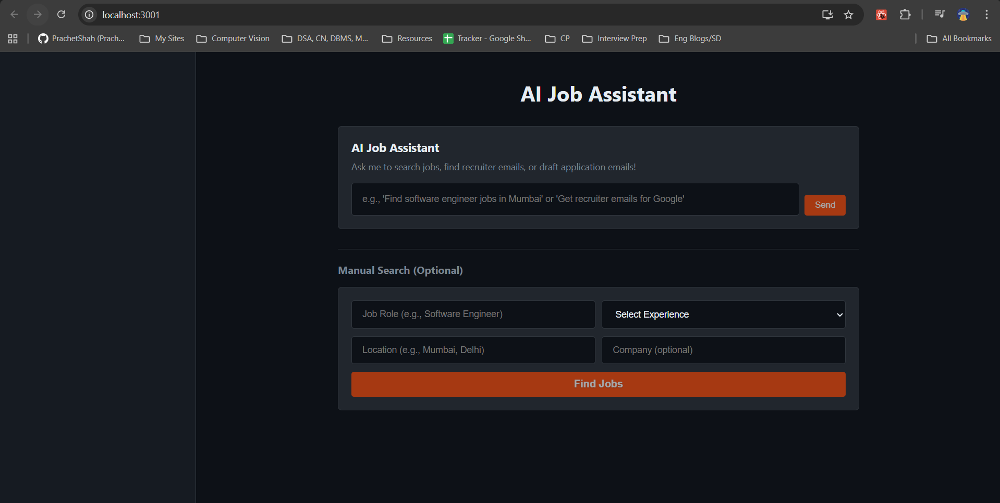
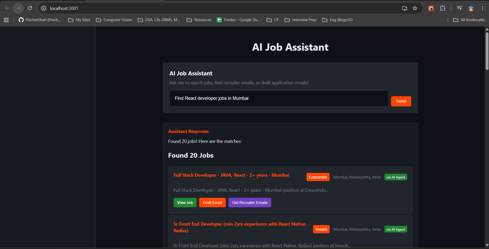
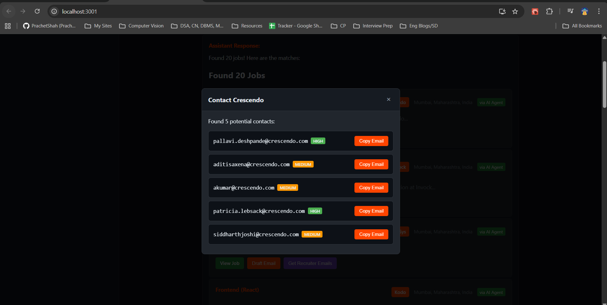
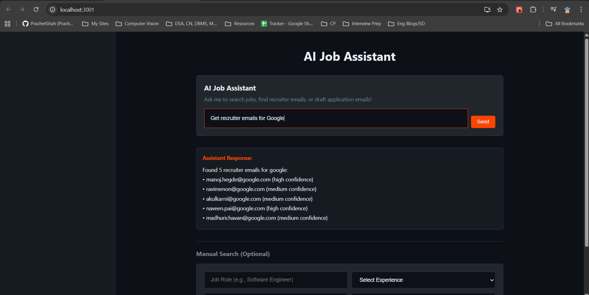
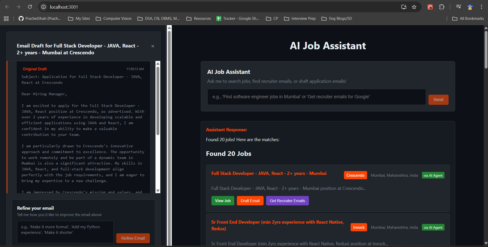
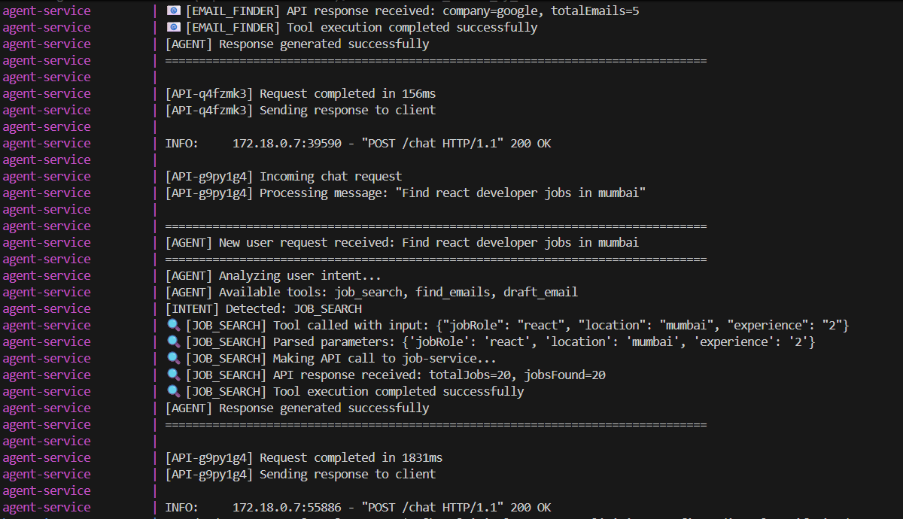
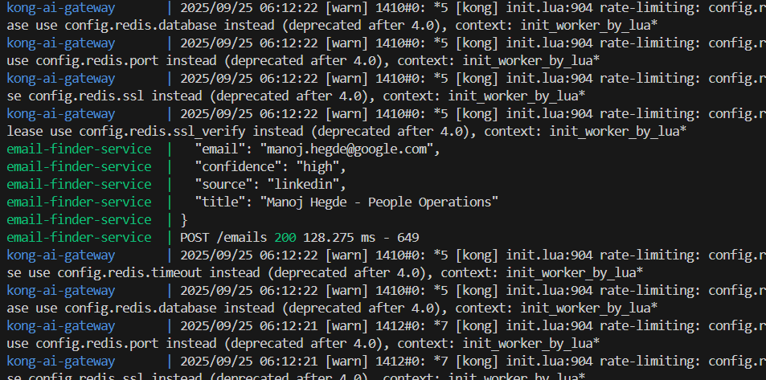
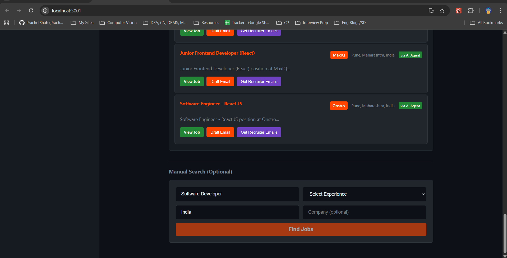
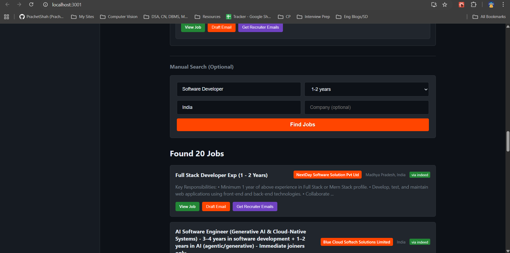

# Agentic Job Search Assistant

An intelligent job search platform powered by Kong AI Gateway and multi-provider AI agents that can search for jobs, find recruiter emails, and draft professional application emails based on the JD, refine it further, all through the same application without the need to switch tabs, through natural language conversations with an intelligent AI model routing and fallback support.

#### Members
- Sanika Ardekar (sanikaardekar@gmail.com)
- Prachet Shah (prachetshah25@gmail.com)

#### [Video Demo](https://youtu.be/f8rd3Q4T1AA)


## Problem Statement & Agentic AI Connection

### What Problem Does It Solve?

Job searching is a complex, multi-step process that typically requires:
- **Manual Platform Navigation**: Switching between multiple job sites (Indeed, Naukri, LinkedIn)
- **Recruiter Contact Discovery**: Spending hours finding the right hiring contacts
- **Personalized Email Crafting**: Writing tailored application emails for each position
- **Context Switching**: Managing information across different tools and platforms

This creates friction, inefficiency, and missed opportunities for job seekers.

This is where Agentic AI comes in, enabling autonomous agents that understand user intent, orchestrate multi-step workflows, and adapt dynamically. Instead of juggling multiple platforms, the system uses natural language to search jobs, find recruiter emails, and draft personalized applications, while preserving context and ensuring seamless execution.

A single conversational interface that replaces hours of manual work with intelligent, autonomous task execution.

## Architecture Overview



## Features

### Kong AI Gateway 
**Orchestrates multi-provider AI routing with intelligent fallback between Cloudflare AI, OpenAI, and Anthropic for maximum reliability and performance.**

### Service Functions 
- **Agent Service**: Processes natural language queries and routes to appropriate microservices
- **Job Service**: Aggregates job listings from Indeed, Naukri, and other platforms
- **Email Finder**: Discovers recruiter contacts using Google Search and Hunter.io APIs
- **Email Service**: Generates personalized application emails via Kong AI Gateway
- **AI Gateway Service**: Manages multi-provider AI routing with automatic failover

## Technology Stack

| Component | Technology | Purpose |
|-----------|------------|---------|
| **Frontend** | React + TypeScript | User interface and interaction |
| **AI Gateway** | Kong AI Gateway | AI request routing, model switching, prompt management |
| **API Gateway** | Kong Gateway | Request routing, authentication, rate limiting |
| **Agent Service** | Python + FastAPI + LangChain | AI agent orchestration |
| **AI Gateway Service** | Node.js + Express | Multi-provider AI routing and fallback |
| **Job Service** | Node.js + Express | Job search and aggregation |
| **Email Service** | Node.js + Express | Email drafting via AI Gateway |
| **Email Finder** | Node.js + Express | Recruiter email discovery |
| **AI Providers** | Cloudflare AI, OpenAI, Anthropic | Multiple LLM providers for reliability |
| **Intent Detection** | Python Regex + LangChain | User intent classification |
| **Containerization** | Docker + Docker Compose | Deployment and orchestration |

### Test Commands
Try these in the AI chat at http://localhost:3001:
- "Find React jobs in Mumbai"
- "Get recruiter emails for Google"
- "Draft email for software engineer position"

## Quick Start

### 1. Clone Repository
```bash
git clone <repository-url>
cd kong-agentic-ai
```

### 2. Configure Environment
```bash
# Copy and edit environment variables
cp .env.example .env
```

Required environment variables:
```env
# Cloudflare AI (Required)
CLOUDFLARE_ACCOUNT_ID=your_account_id
CLOUDFLARE_API_TOKEN=your_api_token

SERPAPI_KEY=your_serpapi_key          # For Google search-based email finding
HUNTER_API_KEY=your_hunter_api_key    # For professional email discovery
CLEARBIT_API_KEY=your_clearbit_api_key # For company domain lookup
```

### 3. Start Services
```bash
# Start all backend services (including Kong AI Gateway)
docker-compose up -d

# Start frontend (in separate terminal)
cd frontend
npm install
npm start
```

### 4. Access Application
- **Frontend**: http://localhost:3001
- **Kong AI Gateway**: http://localhost:8000
- **AI Chat Endpoint**: http://localhost:8000/ai/chat
- **AI Providers**: http://localhost:8000/ai/providers
- **Health Checks**: http://localhost:8000/health

## Quick Commands

### Start Everything
```bash
# Start all backend services
docker-compose up

# Start frontend (new terminal)
cd frontend
npm start
```

## Usage Examples along with Demo Screenshots (Video in end)

### Homepage



### Job Search with AI Enhancement
```
User: "Find React developer jobs in Mumbai"
Agent: [INTENT] Detected: JOB_SEARCH
       [AI_GATEWAY] Using Cloudflare AI for processing
       Searching for React jobs in Mumbai...
       Found 15 jobs! Here are the matches:
       
       1. React Developer at TechCorp
          Location: Mumbai, Maharashtra
          [Apply Here]
       
       2. Frontend Engineer at StartupXYZ
          Location: Mumbai, Maharashtra  
          [Apply Here]
```


### Email Discovery (Either via found jobs, or directly via Agent)
```
User: "Get recruiter emails for Google"
Agent: [INTENT] Detected: EMAIL_FINDER
       Searching emails for Google...
       Found 5 recruiter emails:
       
       - recruiter@google.com (high confidence)
       - talent@google.com (medium confidence)
       - hiring@google.com (high confidence)
```
#### Emails via Found Jobs (Clicking on get Recruiter Emails)


#### Emails via Agent(using prompt)


### Email Drafting with AI Provider Selection (customised based on JD of Job)
```
User: "Draft email for Netflix software engineer position using Claude"
Agent: [INTENT] Detected: EMAIL_DRAFT
       [AI_GATEWAY] Routing to Anthropic Claude for email generation
       Drafting professional email with Claude 3...
       Email drafted successfully!
       
       Subject: Application for Software Engineer Position
       
       Dear Hiring Manager,
       
       I hope this email finds you well. I came across the Software Engineer 
       position at Netflix and I am very excited about the opportunity...
       
       Generated by: anthropic:claude-3-sonnet-20240229
```


## Monitoring & Logs




## Manual Search Functionality without Prompting



