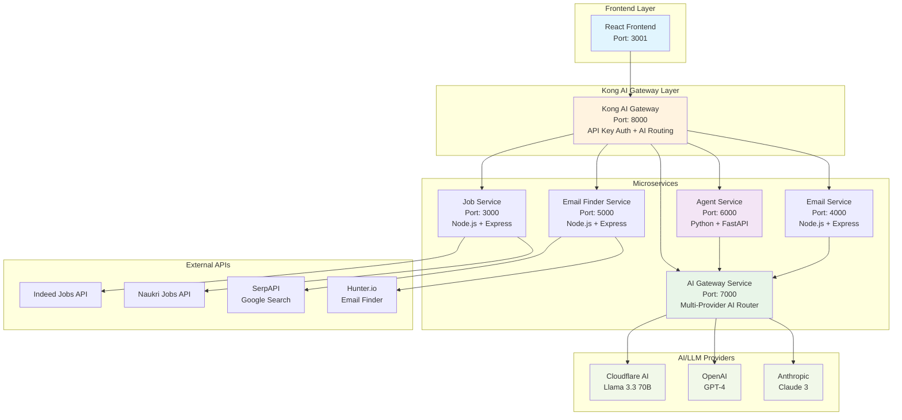

# Kong AI Gateway - Agentic Job Search Assistant

An intelligent job search platform powered by Kong AI Gateway and multi-provider AI agents that can search for jobs, find recruiter emails, and draft professional application emails based on the JD, refine it further, all through the same application without the need to switch tabs, through natural language conversations with an intelligent AI model routing and fallback support.

*Built for hackathon - demonstrating Kong AI Gateway capabilities with multi-provider AI routing <span style="background-color: yellow;">(images demo and video attached in end of readme)*</span>

#### Members
- Sanika Ardekar (sanikaardekar@gmail.com)
- Prachet Shah (prachetshah25@gmail.com)

#### [Video Demo](https://youtu.be/f8rd3Q4T1AA)


## Problem Statement & Agentic AI Connection

### What Problem Does It Solve?

Job searching is a complex, multi-step process that typically requires:
- **Manual Platform Navigation**: Switching between multiple job sites (Indeed, Naukri, LinkedIn)
- **Recruiter Contact Discovery**: Spending hours finding the right hiring contacts
- **Personalized Email Crafting**: Writing tailored application emails for each position
- **Context Switching**: Managing information across different tools and platforms

This creates friction, inefficiency, and missed opportunities for job seekers.

### How It Relates to Agentic AI

This project embodies **Agentic AI** principles by creating autonomous agents that:

#### 🤖 **Autonomous Decision Making**
- **Intent Recognition**: AI agents automatically detect user goals from natural language
- **Tool Selection**: Agents choose appropriate tools (job search, email finder, email drafting) without explicit instruction
- **Provider Routing**: Kong AI Gateway intelligently routes requests to optimal AI providers (Cloudflare, OpenAI, Anthropic)

#### 🔄 **Multi-Step Task Execution**
- **Workflow Orchestration**: Single user request triggers multi-service workflows
- **Context Preservation**: Agents maintain context across job search → email finding → email drafting
- **Error Recovery**: Automatic fallback between AI providers ensures task completion

#### 🧠 **Intelligent Reasoning**
- **Natural Language Understanding**: Converts "Find React jobs in Mumbai" into structured API calls
- **Dynamic Adaptation**: Switches AI models based on task complexity and provider availability
- **Personalization**: Generates contextual emails based on job details and company information

#### 🛠️ **Tool Integration**
- **API Orchestration**: Seamlessly integrates job APIs, email finders, and AI providers
- **Multi-Provider Resilience**: Kong AI Gateway ensures high availability through provider diversity
- **Real-time Processing**: Provides immediate feedback while agents work in background

**Result**: A single conversational interface that replaces hours of manual work with intelligent, autonomous task execution - the essence of Agentic AI.

## Architecture Overview



## Features

### Kong AI Gateway Capabilities
- **Multi-Provider AI Routing**: Intelligent routing between Cloudflare AI, OpenAI, and Anthropic
- **AI Model Switching**: Dynamic model selection based on request type and availability
- **Prompt Management**: Centralized prompt templates and safety guards
- **AI Load Balancing**: Distribute requests across multiple AI providers for reliability
- **Fallback Support**: Automatic failover between AI providers

### AI Agent Capabilities
- **Natural Language Processing**: Understands user intents using multiple AI providers
- **Intent Detection**: Smart pattern matching to determine user requests
- **Tool Execution**: Automatically executes appropriate tools (job search, email finder, email drafting)

### Kong AI Gateway Features
- **Multi-Provider Routing**: Intelligent routing between Cloudflare AI, OpenAI, and Anthropic
- **Dynamic Model Selection**: Automatic model switching based on request type and availability
- **AI Load Balancing**: Distribute requests across multiple AI providers for high availability
- **Prompt Templates**: Centralized prompt management with safety guards
- **Fallback Support**: Automatic failover when primary AI provider is unavailable
- **Rate Limiting**: AI-specific rate limiting and cost control
- **Model Performance Monitoring**: Track response times and success rates per provider

### Job Search
- **Multi-platform Search**: Searches across Indeed, Naukri, and other job platforms
- **Smart Filtering**: Filters by role, experience, location, and company
- **Real-time Results**: Returns up to 15 job listings with clickable apply links

### Email Intelligence
- **Recruiter Email Discovery**: Finds recruiter emails using Google search and Hunter.io
- **AI-Powered Email Drafting**: Cloudflare AI generates personalized application emails
- **Clickable Apply Links**: Direct links to job applications

### Security & Performance
- **API Gateway**: Kong-based routing with API key authentication
- **Rate Limiting**: Built-in request throttling
- **Error Handling**: Comprehensive error handling and logging
- **Containerized**: Full Docker deployment

## Technology Stack

| Component | Technology | Purpose |
|-----------|------------|---------|
| **Frontend** | React + TypeScript | User interface and interaction |
| **AI Gateway** | Kong AI Gateway | AI request routing, model switching, prompt management |
| **API Gateway** | Kong Gateway | Request routing, authentication, rate limiting |
| **Agent Service** | Python + FastAPI + LangChain | AI agent orchestration |
| **AI Gateway Service** | Node.js + Express | Multi-provider AI routing and fallback |
| **Job Service** | Node.js + Express | Job search and aggregation |
| **Email Service** | Node.js + Express | Email drafting via AI Gateway |
| **Email Finder** | Node.js + Express | Recruiter email discovery |
| **AI Providers** | Cloudflare AI, OpenAI, Anthropic | Multiple LLM providers for reliability |
| **Intent Detection** | Python Regex + LangChain | User intent classification |
| **Containerization** | Docker + Docker Compose | Deployment and orchestration |


## Quick Start

### 1. Clone Repository
```bash
git clone <repository-url>
cd kong-agentic-ai
```

### 2. Configure Environment
```bash
# Copy and edit environment variables
cp .env.example .env
```

Required environment variables:
```env
# Cloudflare AI (Required)
CLOUDFLARE_ACCOUNT_ID=your_account_id
CLOUDFLARE_API_TOKEN=your_api_token

SERPAPI_KEY=your_serpapi_key          # For Google search-based email finding
HUNTER_API_KEY=your_hunter_api_key    # For professional email discovery
CLEARBIT_API_KEY=your_clearbit_api_key # For company domain lookup
```

### 3. Start Services
```bash
# Start all backend services (including Kong AI Gateway)
docker-compose up -d

# Start frontend (in separate terminal)
cd frontend
npm install
npm start
```

### 4. Access Application
- **Frontend**: http://localhost:3001
- **Kong AI Gateway**: http://localhost:8000
- **AI Chat Endpoint**: http://localhost:8000/ai/chat
- **AI Providers**: http://localhost:8000/ai/providers
- **Health Checks**: http://localhost:8000/health

## Quick Commands

### Start Everything
```bash
# Start all backend services
docker-compose up

# Start frontend (new terminal)
cd frontend
npm start
```

### View Logs
```bash
# All services
docker-compose logs -f

# Agent service only
docker-compose logs -f agent-service

# Real-time agent thinking
docker-compose logs -f agent-service | grep "AI_GATEWAY\|INTENT\|SEARCH\|EMAIL\|DRAFT"
```

### Test Commands
Try these in the AI chat at http://localhost:3001:
- "Find React jobs in Mumbai"
- "Get recruiter emails for Google"
- "Draft email for software engineer position"

## Usage Examples along with Demo Screenshots (Video in end)

### Homepage


### Job Search with AI Enhancement
```
User: "Find React developer jobs in Mumbai"
Agent: [INTENT] Detected: JOB_SEARCH
       [AI_GATEWAY] Using Cloudflare AI for processing
       Searching for React jobs in Mumbai...
       Found 15 jobs! Here are the matches:
       
       1. React Developer at TechCorp
          Location: Mumbai, Maharashtra
          [Apply Here]
       
       2. Frontend Engineer at StartupXYZ
          Location: Mumbai, Maharashtra  
          [Apply Here]
```


### Email Discovery (Either via found jobs, or directly via Agent)
```
User: "Get recruiter emails for Google"
Agent: [INTENT] Detected: EMAIL_FINDER
       Searching emails for Google...
       Found 5 recruiter emails:
       
       - recruiter@google.com (high confidence)
       - talent@google.com (medium confidence)
       - hiring@google.com (high confidence)
```
#### Emails via Found Jobs (Clicking on get Recruiter Emails)


#### Emails via Agent(using prompt)


### Email Drafting with AI Provider Selection (customised based on JD of Job)
```
User: "Draft email for Netflix software engineer position using Claude"
Agent: [INTENT] Detected: EMAIL_DRAFT
       [AI_GATEWAY] Routing to Anthropic Claude for email generation
       Drafting professional email with Claude 3...
       Email drafted successfully!
       
       Subject: Application for Software Engineer Position
       
       Dear Hiring Manager,
       
       I hope this email finds you well. I came across the Software Engineer 
       position at Netflix and I am very excited about the opportunity...
       
       Generated by: anthropic:claude-3-sonnet-20240229
```


## API Endpoints

### Kong AI Gateway Endpoints
```http
# Chat with AI (multi-provider)
POST /ai/chat
Content-Type: application/json
apikey: hackathon-2024-key
X-AI-Provider: cloudflare

{
  "message": "Help me find a job",
  "provider": "cloudflare",
  "options": {
    "max_tokens": 1024,
    "temperature": 0.7
  }
}

# Generate email via AI
POST /ai/email
Content-Type: application/json
apikey: hackathon-2024-key

{
  "jobTitle": "Software Engineer",
  "companyName": "Google",
  "location": "Mountain View",
  "provider": "openai"
}

# Get available AI providers
GET /ai/providers
apikey: hackathon-2024-key

# Switch AI model
POST /ai/switch-model
Content-Type: application/json
apikey: hackathon-2024-key

{
  "provider": "anthropic",
  "model": "claude-3-sonnet-20240229"
}
```

### Agent Service
```http
POST /chat
Content-Type: application/json
apikey: hackathon-2024-key

{
  "message": "Find React jobs in Mumbai"
}
```

### Job Service
```http
POST /jobs
Content-Type: application/json
apikey: hackathon-2024-key

{
  "jobRole": "React Developer",
  "experience": "2",
  "location": "Mumbai"
}
```

### Email Finder Service
```http
POST /emails
Content-Type: application/json
apikey: hackathon-2024-key

{
  "company": "Google"
}
```

## Monitoring & Logs


### View Service Logs
```bash
# All services
docker-compose logs -f

# Specific service
docker-compose logs -f agent-service

# Real-time agent thinking process
docker-compose logs -f agent-service | grep "AI_GATEWAY\|INTENT\|SEARCH\|EMAIL\|DRAFT"
```

### Health Checks
```bash
# Check all services status
docker-compose ps

# Test API gateway
curl -H "apikey: hackathon-2024-key" http://localhost:8000/health
```

## Manual Search Functionality without Prompting


### AI Chat Interface
- **Natural Language Input**: Type requests in plain English
- **Real-time Processing**: See agent thinking process
- **Formatted Responses**: Clickable links and structured output
- **Error Handling**: User-friendly error messages

### Manual Search (Fallback)
- **Traditional Forms**: Backup option for specific searches
- **Job Cards**: Visual job listings with apply buttons
- **Email Popup**: Recruiter email discovery modal
- **Draft Panel**: Side panel for email composition

## Security

### Authentication
- **API Key Based**: All services protected with API keys
- **Kong Gateway**: Centralized authentication and rate limiting
- **CORS Enabled**: Proper cross-origin resource sharing

### Data Privacy
- **No Data Storage**: No persistent user data storage
- **API Key Rotation**: Support for key rotation
- **Secure Headers**: Security headers in all responses

## Deployment

### Development
```bash
docker-compose up
cd frontend && npm start
```

### Production
```bash
docker-compose -f docker-compose.prod.yml up -d
```

### Scaling
```bash
# Scale specific services
docker-compose up -d --scale agent-service=3
docker-compose up -d --scale job-service=2
```

## License

MIT License - Hackathon Project

**Built with Kong AI Gateway, Multi-Provider AI Routing, LangChain, and Advanced AI Orchestration**

### Architecture Summary
- **Frontend**: React TypeScript application
- **Kong AI Gateway**: Multi-provider AI routing with intelligent fallback
- **API Gateway**: Kong with authentication, rate limiting, and AI plugins
- **Agent Service**: Python FastAPI with LangChain and Kong AI Gateway integration
- **AI Gateway Service**: Node.js service for multi-provider AI routing
- **Microservices**: Node.js services for jobs, emails, and email finding
- **AI Providers**: Cloudflare AI, OpenAI, and Anthropic for diverse AI capabilities