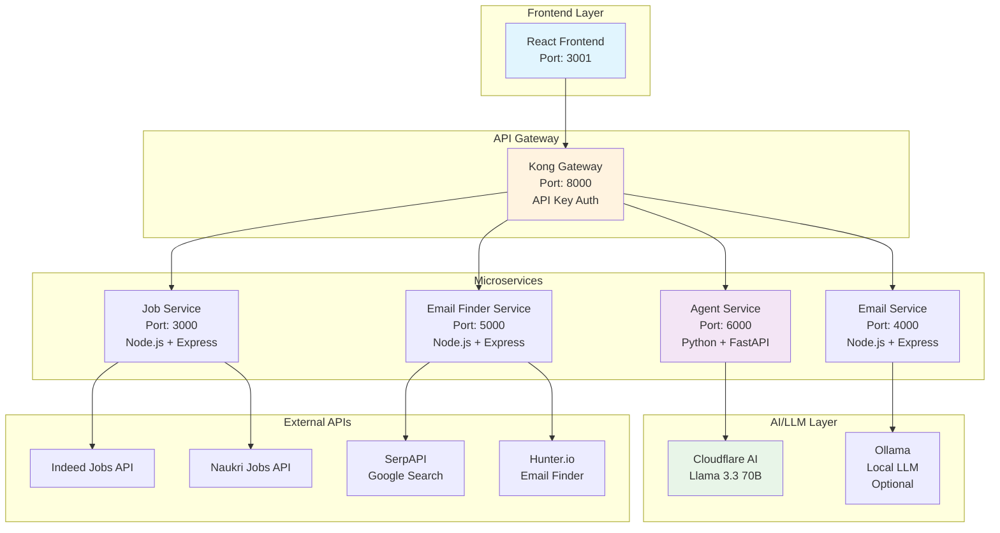

# 🤖 Kong Agentic AI - Job Search Assistant

An intelligent job search platform powered by AI agents that can search for jobs, find recruiter emails, and draft professional application emails through natural language conversations.

## 🏗️ Architecture Overview



## 🚀 Features

### 🎯 AI Agent Capabilities
- **Natural Language Processing**: Understands user intents from conversational input
- **Tool Selection**: Automatically chooses appropriate tools based on user requests
- **Multi-step Reasoning**: Can chain multiple actions to complete complex tasks

### 🔍 Job Search
- **Multi-platform Search**: Searches across Indeed, Naukri, and other job platforms
- **Smart Filtering**: Filters by role, experience, location, and company
- **Real-time Results**: Returns up to 15 job listings with clickable apply links

### 📧 Email Intelligence
- **Recruiter Email Discovery**: Finds recruiter emails using Google search and Hunter.io
- **Professional Email Drafting**: AI-generated personalized application emails
- **Copy-to-Clipboard**: Easy email copying functionality

### 🛡️ Security & Performance
- **API Gateway**: Kong-based routing with API key authentication
- **Rate Limiting**: Built-in request throttling
- **Error Handling**: Comprehensive error handling and logging
- **Containerized**: Full Docker deployment

## 🛠️ Technology Stack

| Component | Technology | Purpose |
|-----------|------------|---------|
| **Frontend** | React + TypeScript | User interface and interaction |
| **API Gateway** | Kong | Request routing, authentication, rate limiting |
| **Agent Service** | Python + FastAPI + LangChain | AI agent orchestration |
| **Job Service** | Node.js + Express | Job search and aggregation |
| **Email Service** | Node.js + Express | Email drafting |
| **Email Finder** | Node.js + Express | Recruiter email discovery |
| **LLM** | Cloudflare AI (Llama 3.3 70B) | Natural language processing |
| **Containerization** | Docker + Docker Compose | Deployment and orchestration |

## 📋 Prerequisites

- Docker & Docker Compose
- Node.js 18+ (for frontend development)
- Cloudflare AI account
- API keys for external services (optional but recommended)

## ⚡ Quick Start

### 1. Clone Repository
```bash
git clone <repository-url>
cd kong-agentic-ai
```

### 2. Configure Environment
```bash
# Copy and edit environment variables
cp .env.example .env
```

Required environment variables:
```env
# Cloudflare AI (Required)
CLOUDFLARE_ACCOUNT_ID=your_account_id
CLOUDFLARE_API_TOKEN=your_api_token

# Optional API Keys (for enhanced functionality)
SERPAPI_KEY=your_serpapi_key
HUNTER_API_KEY=your_hunter_api_key
CLEARBIT_API_KEY=your_clearbit_api_key
```

### 3. Start Services
```bash
# Start all backend services
docker-compose up -d

# Start frontend (in separate terminal)
cd frontend
npm install
npm start
```

### 4. Access Application
- **Frontend**: http://localhost:3001
- **API Gateway**: http://localhost:8000
- **Health Checks**: http://localhost:8000/health

## 💬 Usage Examples

### Job Search
```
User: "Find React developer jobs in Mumbai"
Agent: 🎯 [INTENT] Detected: JOB_SEARCH
       🔍 Searching for React jobs in Mumbai...
       ✅ Found 15 jobs! Here are the matches:
       
       1. React Developer at TechCorp
          📍 Mumbai, Maharashtra
          🔗 [Apply Here]
       
       2. Frontend Engineer at StartupXYZ
          📍 Mumbai, Maharashtra  
          🔗 [Apply Here]
```

### Email Discovery
```
User: "Get recruiter emails for Google"
Agent: 🎯 [INTENT] Detected: EMAIL_FINDER
       📧 Searching emails for Google...
       ✅ Found 5 recruiter emails:
       
       • recruiter@google.com (high confidence)
       • talent@google.com (medium confidence)
       • hiring@google.com (high confidence)
```

### Email Drafting
```
User: "Draft email for Netflix software engineer position"
Agent: 🎯 [INTENT] Detected: EMAIL_DRAFT
       ✏️ Drafting professional email...
       ✅ Email drafted successfully!
       
       Subject: Application for Software Engineer Position
       
       Dear Hiring Manager,
       
       I hope this email finds you well. I came across the Software Engineer 
       position at Netflix and I am very excited about the opportunity...
```

## 🔧 API Endpoints

### Agent Service
```http
POST /chat
Content-Type: application/json
apikey: hackathon-2024-key

{
  "message": "Find React jobs in Mumbai"
}
```

### Job Service
```http
POST /jobs
Content-Type: application/json
apikey: hackathon-2024-key

{
  "jobRole": "React Developer",
  "experience": "2",
  "location": "Mumbai"
}
```

### Email Finder Service
```http
POST /emails
Content-Type: application/json
apikey: hackathon-2024-key

{
  "company": "Google"
}
```

## 📊 Monitoring & Logs

### View Service Logs
```bash
# All services
docker-compose logs -f

# Specific service
docker-compose logs -f agent-service

# Real-time agent thinking process
docker-compose logs -f agent-service | grep "🤖\|🎯\|🔍\|📧\|✏️"
```

### Health Checks
```bash
# Check all services status
docker-compose ps

# Test API gateway
curl -H "apikey: hackathon-2024-key" http://localhost:8000/health
```

## 🎨 Frontend Features

### AI Chat Interface
- **Natural Language Input**: Type requests in plain English
- **Real-time Processing**: See agent thinking process
- **Formatted Responses**: Clickable links and structured output
- **Error Handling**: User-friendly error messages

### Manual Search (Fallback)
- **Traditional Forms**: Backup option for specific searches
- **Job Cards**: Visual job listings with apply buttons
- **Email Popup**: Recruiter email discovery modal
- **Draft Panel**: Side panel for email composition

## 🔒 Security

### Authentication
- **API Key Based**: All services protected with API keys
- **Kong Gateway**: Centralized authentication and rate limiting
- **CORS Enabled**: Proper cross-origin resource sharing

### Data Privacy
- **No Data Storage**: No persistent user data storage
- **API Key Rotation**: Support for key rotation
- **Secure Headers**: Security headers in all responses

## 🚀 Deployment

### Development
```bash
docker-compose up
cd frontend && npm start
```

### Production
```bash
docker-compose -f docker-compose.prod.yml up -d
```

### Scaling
```bash
# Scale specific services
docker-compose up -d --scale agent-service=3
docker-compose up -d --scale job-service=2
```

## 🤝 Contributing

1. Fork the repository
2. Create feature branch (`git checkout -b feature/amazing-feature`)
3. Commit changes (`git commit -m 'Add amazing feature'`)
4. Push to branch (`git push origin feature/amazing-feature`)
5. Open Pull Request

## 📝 License

This project is licensed under the MIT License - see the [LICENSE](LICENSE) file for details.

## 🆘 Troubleshooting

### Common Issues

**Agent not responding:**
```bash
# Check Cloudflare credentials
docker-compose logs agent-service | grep "CLOUDFLARE"

# Restart agent service
docker-compose restart agent-service
```

**No jobs found:**
```bash
# Check job service logs
docker-compose logs job-service

# Verify API keys in .env file
```

**Frontend not loading:**
```bash
# Check if frontend is running
cd frontend && npm start

# Verify Kong gateway
curl http://localhost:8000/health
```

### Performance Optimization

**Faster responses:**
- Use SerpAPI for email finding
- Add Hunter.io API key
- Scale agent service replicas

**Better job results:**
- Add Indeed API key
- Configure Naukri API access
- Increase job result limits

## 📞 Support

For support and questions:
- Create an issue in the repository
- Check the troubleshooting section
- Review service logs for errors

---

**Built with ❤️ using Kong, LangChain, and Cloudflare AI**