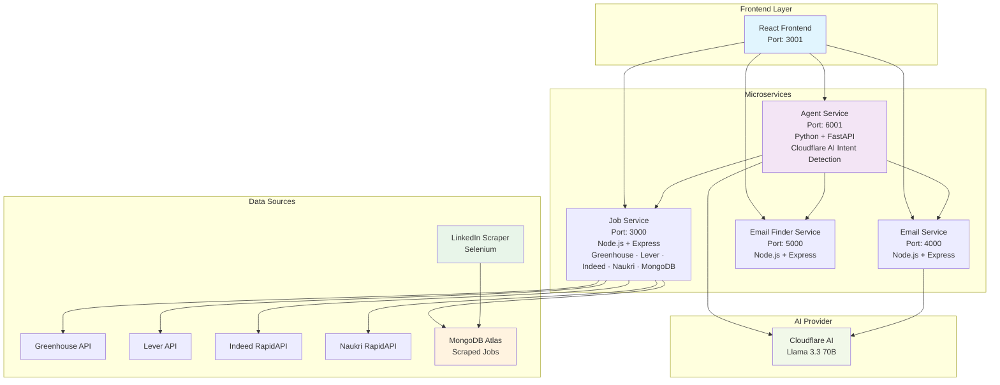

# Agentic Job Search Assistant

An intelligent job search platform powered by multi-provider AI agents that can search for jobs, find recruiter emails, and draft professional application emails through natural language conversations.

#### Members
- Sanika Ardekar (sanikaardekar@gmail.com)

<!-- #### [Video Demo](https://youtu.be/f8rd3Q4T1AA) -->

---

## Problem Statement & Agentic AI Connection

Job searching is a complex, multi-step process that typically requires:
- **Manual Platform Navigation**: Switching between multiple job sites (Indeed, Naukri, LinkedIn)
- **Recruiter Contact Discovery**: Spending hours finding the right hiring contacts
- **Personalized Email Crafting**: Writing tailored application emails for each position
- **Context Switching**: Managing information across different tools and platforms

This is where Agentic AI comes in — autonomous agents that understand user intent, orchestrate multi-step workflows, and adapt dynamically. Instead of juggling multiple platforms, the system uses natural language to search jobs, find recruiter emails, and draft personalized applications.

---

## Architecture Overview



---

## Features

### AI Search (Agent Service)
Uses Cloudflare AI (Llama 3.3 70B) to detect intent from natural language and route to the right service:
- `job_search` → calls `POST /jobs` on job-service
- `email_finder` → calls `POST /emails` on email-finder-service
- `email_draft` → calls `POST /email/draft` on email-service

### Job Search (Job Service)
- **Live search** via `POST /jobs` — searches Greenhouse, Lever, Indeed, Naukri based on role/location/company
- **MongoDB GET** via `GET /mongoData` — fetch scraped jobs stored in MongoDB Atlas
- **MongoDB POST** via `POST /mongoData` — bulk upsert jobs from the scraper

### LinkedIn Scraper
Headless Chrome (Selenium) scraper that collects LinkedIn job listings and pushes them to MongoDB via `POST /mongoData`. Run independently from the `scraper/` directory.

### Email Finder
Discovers recruiter contacts for a given company. Currently generates realistic dummy data. Can be extended with Hunter.io or Clearbit APIs.

### Email Drafting + Refinement
Generates personalized application emails using Cloudflare AI. Supports iterative refinement — tell the AI how to improve the draft and it generates a new version.

---

## Technology Stack

| Component | Technology | Purpose |
|-----------|------------|---------|
| **Frontend** | React + TypeScript | Tabbed UI — AI Search, Manual Search, LinkedIn Scraped Jobs |
| **Agent Service** | Python + FastAPI | Cloudflare AI intent detection and service orchestration |
| **Job Service** | Node.js + Express + MongoDB | Live job search (Greenhouse/Lever/Indeed/Naukri) + scraped jobs storage |
| **Email Service** | Node.js + Express | Email drafting and refinement using Cloudflare AI |
| **Email Finder** | Node.js + Express | Recruiter email discovery |
| **Scraper** | Python + Selenium | LinkedIn job scraper → MongoDB |
| **AI Provider** | Cloudflare AI (Llama 3.3 70B) | Intent detection and email generation |
| **Database** | MongoDB Atlas | Storage for LinkedIn scraped jobs |
| **Containerization** | Docker + Docker Compose | Backend service orchestration |

---

## Job Service API Routes

| Method | Route | Description |
|--------|-------|-------------|
| `GET` | `/health` | Health check |
| `POST` | `/jobs` | Live job search (Greenhouse, Lever, Indeed, Naukri) |
| `GET` | `/jobs` | Source-specific job fetch (`?source=greenhouse&token=...`) |
| `GET` | `/job/:source/:id` | Single job detail |
| `GET` | `/mongoData` | Fetch scraped jobs from MongoDB (supports `?jobRole`, `?location`, `?company`, `?limit`) |
| `POST` | `/mongoData` | Bulk upsert scraped jobs `{ jobs: [...], source: "linkedin-scraper" }` |

---

## Quick Start

### 1. Clone Repository
```bash
git clone <repository-url>
cd kong-agentic-ai
```

### 2. Configure Environment
```bash
cp .env.example .env
cd frontend && cp .env.example .env && cd ..
```

Required backend `.env` variables:
```env
# Cloudflare AI (Required)
CLOUDFLARE_ACCOUNT_ID=your_account_id
CLOUDFLARE_API_TOKEN=your_api_token

# MongoDB Atlas (Required for scraped jobs)
MONGODB_URI=your_mongodb_connection_string

# Optional: for real email finding
HUNTER_API_KEY=your_hunter_api_key
CLEARBIT_API_KEY=your_clearbit_api_key
SERPAPI_KEY=your_serpapi_key
```

Frontend `.env`:
```env
REACT_APP_API_BASE_URL=http://localhost
```

### 3. Start Backend Services
```bash
docker-compose up -d
```

### 4. Start Frontend
```bash
cd frontend
npm install
npm start
```

### 5. Access Application
| Service | URL |
|---------|-----|
| Frontend | http://localhost:3001 |
| Agent Service | http://localhost:6001 |
| Job Service | http://localhost:3000 |
| Email Service | http://localhost:4000 |
| Email Finder | http://localhost:5000 |

---

## LinkedIn Scraper

The scraper runs independently and pushes jobs to MongoDB.

```bash
cd scraper
pip install -r requirements.txt

# Default search (software developer, Mumbai/Bangalore)
python main.py --output jobs.json

# Custom search
python main.py --keywords "React developer" --location "Bangalore, India" --pages 3 --output jobs.json

# Show browser window (useful if hitting CAPTCHA)
python main.py --no-headless
```

Jobs are automatically uploaded to `http://localhost:3000/mongoData` and appear in the **LinkedIn Scraped** tab in the frontend.

---

## Troubleshooting

**Services not starting:**
```bash
docker-compose ps
docker-compose logs agent-service
docker-compose down && docker-compose up -d
```

**Test all services:**
```bash
node test-services.js
node test-agent.js
```

**MongoDB connection error (SSL):**
Ensure your `MONGODB_URI` includes `?tls=true&retryWrites=true&w=majority` and the job-service Dockerfile uses `node:20-slim` (not alpine).

**Agent returning "unknown" intent:**
Check Cloudflare credentials in `.env` and verify with:
```bash
docker-compose logs agent-service --tail=20
```

---

## Deployment

```bash
# Update frontend API URL
echo "REACT_APP_API_BASE_URL=http://your-server-ip" > frontend/.env

# Build frontend
cd frontend && npm run build

# Start backend
docker-compose up -d
```

Serve the `frontend/build` folder with nginx or deploy to Vercel/Netlify.

---

## Usage Examples

### AI Search Tab
```
"Find React developer jobs in Mumbai"
→ Detects: job_search | jobRole: react | location: mumbai
→ Returns job cards with Apply, Draft Email, Get Recruiter Emails buttons

"Get recruiter emails for Google"
→ Detects: email_finder | company: google
→ Returns list of recruiter emails with confidence scores

"Draft email for software engineer at Netflix"
→ Detects: email_draft | jobTitle: software engineer | company: netflix
→ Opens email modal with subject + body, supports AI refinement
```

### Manual Search Tab
Fill in Job Role, Experience, Location (and optionally Company) to search live APIs directly.

### LinkedIn Scraped Tab
Click **Load Jobs** to fetch all jobs scraped from LinkedIn and stored in MongoDB.
